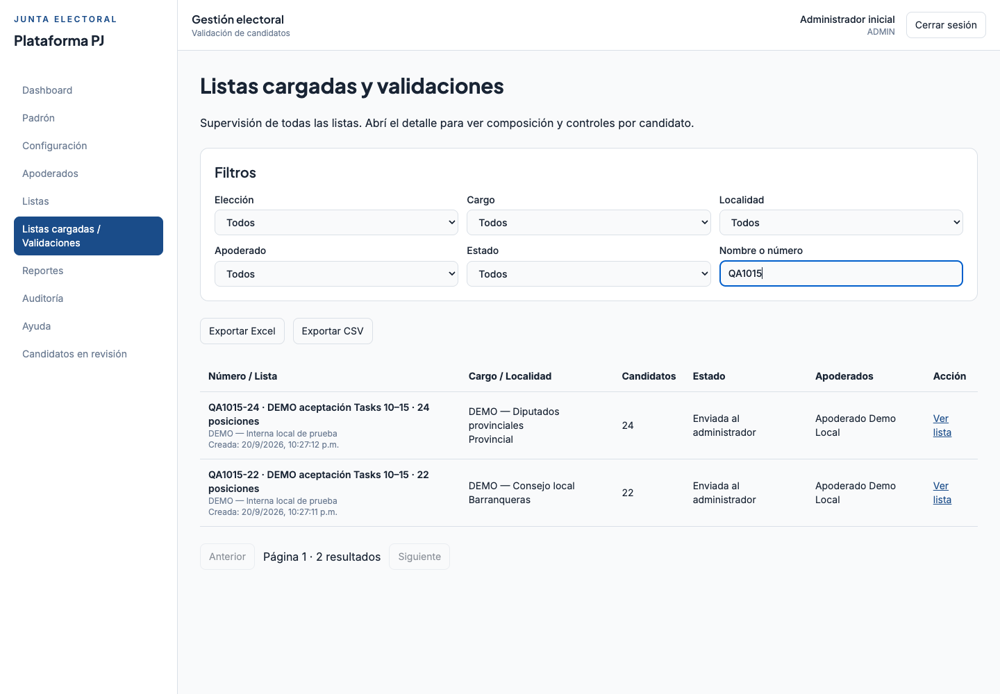
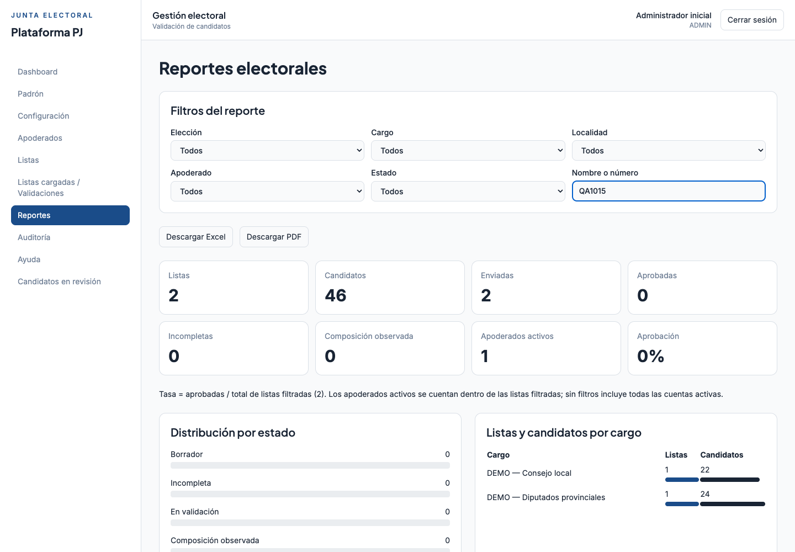
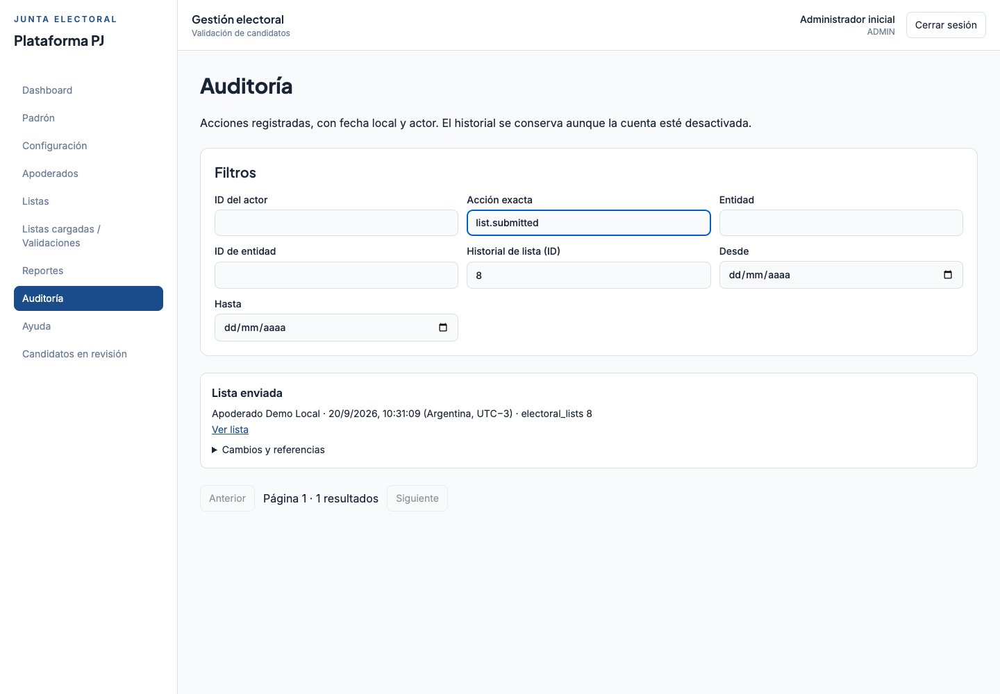

# Guía ADMIN — entorno local

Abrí <http://localhost:5173> e ingresá con tu cuenta. Las credenciales locales están en
`backend/.env`; nunca se incluyen en esta guía. Las capturas usan solo datos sintéticos.

## Preparar el proceso

1. En **Configuración**, creá elección, apertura/cierre, cargos y localidades. Los días
   de carga son inclusivos según Argentina.
2. Guardá una versión de reglas para cada cargo. Marcá las plantillas demo como prueba.
   Una nueva versión no cambia listas existentes; una lista vacía puede adoptar la actual.
3. En **Apoderados → Invitaciones**, invitá por correo y asigná módulos por elección/cargo/localidad.
   La asignación explícita de cada lista se gestiona en su detalle. Revocar un módulo
   retira el acceso aunque quede una asignación de lista.
4. En **Padrón**, importá XLSX (hasta 20 MB). La tabla de 18 campos y el historial muestran
   lote vigente, filas válidas/errores. Matrícula equivale a documento. Si el lote falla,
   corregí el archivo y reimportá: el anterior permanece vigente. No existe API del padrón.

## Supervisar y exportar

En **Listas cargadas / Validaciones**, buscá por nombre/número y filtrá elección, cargo,
localidad, estado o apoderado. **Ver lista** abre composición, asignados y controles por
candidato; las observaciones tienen motivo. **Candidatos en revisión** permite ir a la
posición observada dentro de su lista. No hay botones para dispensar requisitos o aprobar
manualmente; Enviada al administrador y Aprobada por sistema son estados diferentes.

**Dashboard** y **Reportes** calculan datos de la base. El alcance electoral se muestra
explícitamente. La tasa divide aprobadas por todas las listas del filtro; no suma enviadas
y aprobadas dos veces. El reporte filtra 2 listas, 46 candidatos, 2 enviadas y 0 aprobadas
en esta captura, porque RENAPER y las reglas institucionales siguen pendientes.

Exportá listas en Excel/CSV, reportes en Excel/PDF y padrón en Excel/CSV. Los archivos
incluyen todo el resultado del filtro, aunque la pantalla tenga varias páginas. Si el
resultado supera el límite, acotá filtros. Para conservar ceros al abrir CSV, importá
la columna Matrícula como Texto; Excel ya la conserva como texto en XLSX.

## Reconstruir el recorrido

Desde **Historial de esta lista**, **Auditoría del candidato** o el menú **Auditoría**,
consultá actor, acción, fecha Argentina y referencias. Los campos Antes/Después conservan
los cambios mínimos; los IDs permiten filtrar exactamente un recurso. Para buscar un
envío usá acción `list.submitted`; exportaciones usan `export.generated`.

El contenido enviado queda en lectura. ADMIN puede mantener sus asignaciones de acceso.
No hay reapertura ni eliminación de auditoría. Un fallo no deja un evento de éxito falso.

## Soporte y recuperación

**Ayuda** explica flujos y muestra `SUPPORT_CONTACT` si fue configurado. Para restablecer
acceso, entrá a **Seguridad de cuenta**, desmarcá «Solo bloqueadas», buscá la cuenta
y elegí **Enviar recuperación**. Confirmá tu contraseña de administrador. La persona
recibirá un enlace de un uso; ADMIN no asigna claves a cuentas existentes.

En la misma pantalla podés retirar bloqueos por reintentos, con motivo y contraseña
de confirmación. Un desbloqueo no reactiva una cuenta deshabilitada ni cambia su rol.
Al desactivar se revocan sesiones y enlaces pendientes. El alta manual fue reemplazada por invitaciones. ADMIN nunca elige la contraseña
inicial de otra cuenta.

Errores habituales: 401 → ingresar nuevamente; 403 → revisar rol, módulo y lista;
409 → comprobar plazo/estado/duplicados; importación fallida → revisar filas del historial;
descarga 413 → acotar filtros. Ante una interrupción de red, recargá el recurso antes de
repetir una operación: puede haberse completado en el servidor.

Ver [setup y respaldo](OPERACION_LOCAL.md), [contratos](SUBMISSION_REPORTING_AUDIT.md)
y [aceptación y pendientes](task/INFORME_10_15.md).

## Invitar apoderados

En **Apoderados → Invitaciones**, ingresá el correo, agregá los módulos habilitados
y confirmá con tu contraseña de administrador. **Enviar invitación** deja el correo
en cola; **Actualizar estado del correo** permite ver si SMTP lo aceptó o falló.
La aceptación de SMTP no garantiza entrega al buzón. En local revisá Mailpit.

La persona completa nombre, usuario y contraseña al abrir su enlace, válido por
48 horas. Hasta entonces aparece como invitación pendiente, sin cuenta activa.
**Reenviar** crea otro enlace e invalida el anterior (espera mínima: 60 segundos).
**Cancelar invitación** impide su aceptación. Las invitaciones vencidas pueden
reenviarse; las canceladas requieren una nueva invitación. Las aceptadas ya son cuentas.

Si el correo ya tiene cuenta, usá gestión/recuperación, no otra invitación. Si el
invitador perdió su autorización o un catálogo dejó de estar activo, cancelá y emití
una invitación con módulos vigentes. Después de aceptar, asigná cada lista de forma
explícita: tener módulo o municipio no concede acceso a listas de otras personas.
Las cuentas anteriores se muestran sin verificación histórica; eso no les quita acceso.
