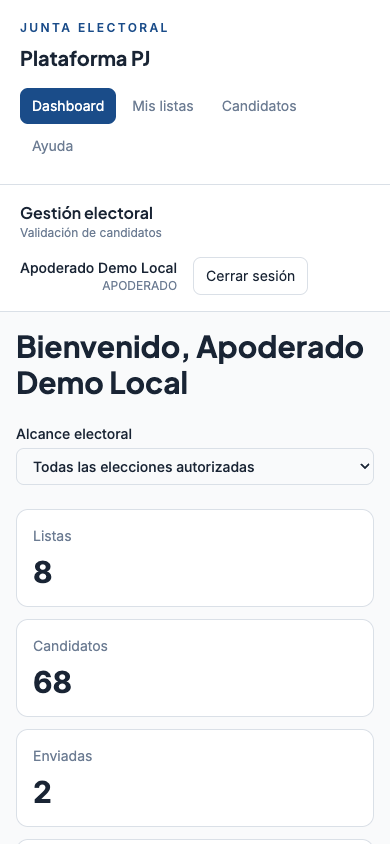
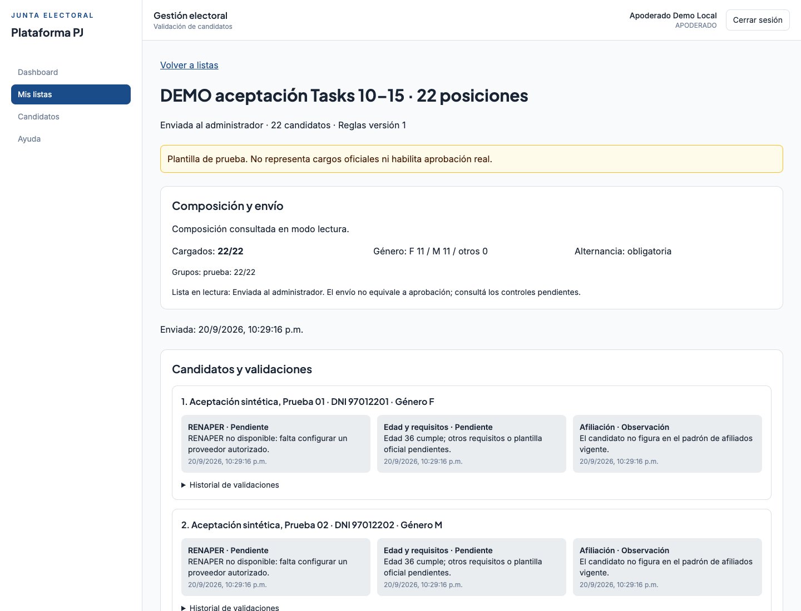

# Guía APODERADO — entorno local

Ingresá en <http://localhost:5173> con tu cuenta. La Junta administra altas, permisos y
restablecimiento de contraseña. No compartas claves ni copies datos personales del manual
a un entorno de prueba; las capturas siguientes contienen personas ficticias.

1. **Dashboard** muestra únicamente módulos y listas habilitados. Elegí una elección
   o el alcance de todas las autorizadas. Si no hay módulos, pedí asignación al ADMIN.
2. Entrá a **Mis listas** → Crear lista. Completá nombre/número, elección, cargo y
   localidad cuando corresponda. Abrí una lista existente con **Ver lista**.
3. Cargá DNI, nombre, apellido, fecha de nacimiento, género y posición. **Guardar borrador**
   conserva los datos mínimos y deja los requisitos pendientes. **Guardar y validar**
   evalúa afiliación, edad/requisitos y estado de RENAPER.
4. Revisá los mensajes de cada candidato. No figurar en el padrón genera una observación,
   pero permite guardar y continuar. RENAPER pendiente no significa identidad verificada.
   Usá **Editar candidato** para corregir y **Volver a validar** cuando cambie el padrón.
5. **Validar composición** comprueba posiciones/grupos, paridad y alternancia configurada.
   Diputados demo tiene 16 titulares + 8 suplentes sin alternancia; Consejos demo tiene
   22 posiciones de prueba alternadas. La pantalla identifica las posiciones a corregir.
6. Cuando la composición esté completa, pulsá **Enviar lista** y confirmá en pantalla.
   Las advertencias de afiliación y los pendientes de RENAPER permiten enviarla a revisión.
   Una composición incompleta o incorrecta impide enviarla.
7. Después del envío los datos y candidatos quedan en lectura. **Enviada al administrador**
   no significa **Aprobada por sistema**. La aprobación necesita todos los controles
   obligatorios vigentes y reglas institucionales confirmadas.

Las listas compartidas requieren asignación explícita además del módulo. Compartir localidad
con otra cuenta no concede acceso. Si desaparece una lista, pedí revisar ambas habilitaciones.

En el ingreso, usá **Olvidé mi contraseña** para recibir un enlace por correo (30 minutos,
un uso). Después de cambiarla, iniciá sesión de nuevo; las sesiones anteriores quedan cerradas.
En **Seguridad de cuenta** podés cambiar tu contraseña y consultar/cerrar sesiones.
En **Ayuda**, consultá instrucciones y contacto configurado. Si vence
la sesión, ingresá nuevamente. Si falla la red durante un guardado/envío, recargá el detalle
antes de repetir. El doble envío no crea dos eventos ni dos listas. No hay reapertura automática;
consultá a la Junta por el canal habitual si una lista enviada requiere corrección.

El proyecto aún no tiene API RENAPER. Las reglas y personas de estas pruebas no acreditan
validez institucional. Ver [estado y evidencia](task/INFORME_10_15.md).

## Primer acceso por invitación

Abrí el enlace recibido por correo y completá nombre, usuario y contraseña de
15–128 caracteres. El correo está fijado por la invitación. No se pide DNI ni datos
de candidatos para crear esta cuenta. Abrir el enlace no consume la invitación;
**Crear mi cuenta** confirma el alta. Después iniciá sesión normalmente.

Si venció, fue cancelado o reenviado, solicitá un enlace vigente al administrador.
Si recargaste la página y ya no aparece el formulario, reabrí el correo: el secreto
se elimina de la URL y no se guarda en el navegador. No compartas ese enlace.
Una sesión abierta de otra cuenta permanece igual; la página permite cerrarla
explícitamente para ingresar con la cuenta nueva. Consultá tus datos y sesiones en
**Seguridad de cuenta**. Si no ves listas, pedí asignación explícita al ADMIN.
